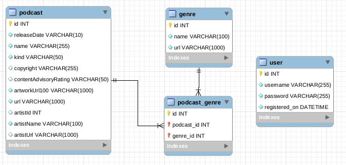

# Top 100 Podcasts API

## Setup
- Open a terminal.
- Create a virtual environment (this is optional)
- Install the dependencies.

``` shell script
pip3 install -r requirements.txt
```

## How to run the code?
Type in the terminal:
```shell script
python3 app.py
```

First, the app creates all necessary tables in the database and it displays 
the message **Populating Database...** when this is finished, it will display
**Database has been populated!!!**.

IMPORTANT: Copy the generated URI (in this case `http://localhost:5000`).

## How to create a new user?
To use this API you must be authenticated. You need to create a new user
in order to receive a token that will be used to call all the services.

- Open Postman (or another REST client).
- Use the endpoint `http://localhost:5000/api/create-user` with POST method.
- Add a new header to request called 'Content-Type' with 'application/json' as
value.
- Add a JSON to the request's body like the following:


If all of this is OK you will see the message **New user created!**.

## Log in
To log in into the API follow these steps:

- Use the endpoint `http://localhost:5000/api/login` with POST method.
- In `Authorization` select `Basic Auth`.
- Provide your username and password like the following:


If login is valid, a token will be generated.

IMPORTANT: make sure to COPY IT!!

## How to use this token?
To use all of the following endpoints, you must use the generated token.

In all services do the following:
- Add a new header called 'x-access-token' with the token value.


IMPORTANT: The token has is valid for 30 minutes.

## Database and Schema creation
### Schema


The database has four tables: user, podcast, genre and an intermediate 
table for many-to-many relationship called podcast_genre.

The app gets all of results to itunes API, then it gets all unique genres from 
those. At last, the app adds all genres and podcasts to the database.

## Solution to exercises
### Exercise 1
> Service to provide a search lookup within the podcasts.

The function `search` filters all podcasts by a name using the LIKE operator
because this one makes a search for a specific pattern.

- Use the endpoint `http://localhost:5000/api/search` with the GET method.
- Send a JSON containing a `name` key and a string as a value.


### Exercise 2
> Service that would allow to save the top 20 podcasts to a separate JSON file

The function `save_top_20` gets all podcasts from database sorted in
ascending order by id column and save this in `files/top_20.json`.

- Use the endpoint `http://localhost:5000/api/top-20` with the POST method.


### Exercise 3
> Service to replace the top 20 podcasts for the bottom 20 to said JSON file.

The function `replace_top_20` gets all podcasts from database sorted in
descending order by id column and save this in the same JSON file called
`files/top_20.json`.

- Use the endpoint `http://localhost:5000/api/replace-top-20` with the POST
method.


### Exercise 4
> Service to remove a podcast, using a given identifier.

The function `delete_podcast` needs an id to search the podcast to delete. You
can use any id from the podcasts previously saved within the JSON file.

If the specified podcast does not exist, this service return an error message 
else return a success message with **Podcast with id ### has been deleted**.

- Use the endpoint `http://localhost:5000/api/<id>` with the DELETE method
- Replace `<id>` with a podcast id you want to delete.


### Exercise 5
> Service to return the podcasts grouped by genres, even if they appear as
> duplicates within some of categories

The function `group_by_genre` uses a query to join the three related tables 
sorted by genre name. After this, this records are inserted in a dictionary to 
return the response.

- Use the endpoint `http://localhost:5000/api/group-by-genre` with the GET
method


 
 